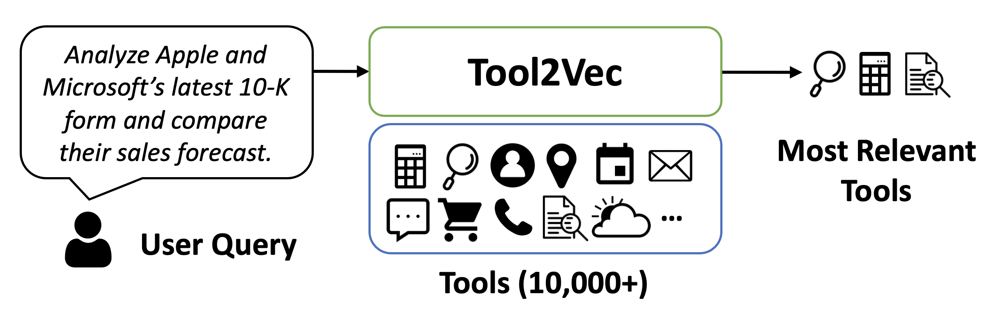

# Efficient and Scalable Estimation of Tool Representations in Vector Space
<!--- BADGES: START --->
[][#arxiv-paper-package]
[][#license-gh-package]

[#license-gh-package]: https://lbesson.mit-license.org/
[#arxiv-paper-package]: https://arxiv.org/abs/2409.02141
<!--- BADGES: END --->



Efficient and scalable tool retrieval is critical for modern function calling applications. We propose novel approaches to the tool retrieval problem: (1) Tool2Vec: usage-driven tool embedding generation for tool retrieval, (2) ToolRefiner: a staged retrieval method that iteratively improves the quality of retrieved tools, and (3) MLC: framing tool retrieval as a multi-label classification problem. With these new methods, we achieve improvements of up to 27.28 in Recall@K on the ToolBench dataset. Furthermore, we introduce ToolBank, a set of domain-specific tool retrieval datasets to encourage further research. For more details, please check out our paper [here](https://arxiv.org/abs/2409.02141).

---
## Quickstart

### 1. Create a Python 3.10 environment and install dependencies
```sh
python3.10 -m venv .venv310
source .venv310/bin/activate
pip install --upgrade pip
pip install -r requirements.txt
```

### 2. Prepare your data
- You need three files: `train.json`, `val.json`, and `test.json` (see below for format).
- You can generate these using the provided scripts or your own data.

### 3. Run the full pipeline
From the project root:
```sh
PYTHONPATH=. python toolrag/run_full_pipeline.py \
  --train-file toolrag/train.json \
  --val-file toolrag/val.json \
  --test-file toolrag/test.json
```

This will:
- Generate embeddings
- Train the reranker model
- Evaluate tool selection on the test set

---
## Data Format
Each file should be a JSON list of objects with at least:
```json
{
  "tool_name": "...",
  "query": "..."
}
```

---
## Download ToolBank Dataset
1. Install HuggingFace `datasets` package
```sh
pip install datasets
```
2. Load the dataset from HuggingFace
```python
from datasets import load_dataset

tool_bank = load_dataset("squeeze-ai-lab/ToolBank")
```
[Dataset link](https://huggingface.co/datasets/squeeze-ai-lab/ToolBank)

---
## More
- For generating synthetic data, see `toolrag/data_generation/README.md`.
- For embedding generation, see `toolrag/tool2vec/README.md`.
- For MLC model, see `toolrag/mlc/README.md`.
- For ToolRefiner, see `toolrag/toolrefiner/README.md`.

---
## Citation
```
@misc{moon2024efficient,
      title={Efficient and Scalable Estimation of Tool Representations in Vector Space}, 
      author={Suhong Moon and Siddharth Jha and Lutfi Eren Erdogan and Sehoon Kim and Woosang Lim and Kurt Keutzer and Amir Gholami},
      year={2024},
      eprint={2409.02141},
      archivePrefix={arXiv},
      primaryClass={cs.LG},
      url={https://arxiv.org/abs/2409.02141}, 
}
```
